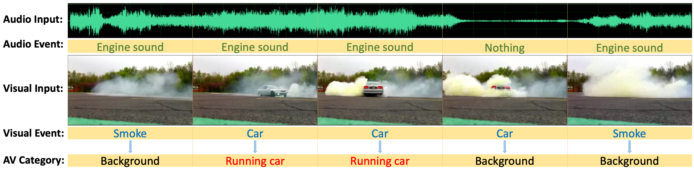

# Cross Modal Background Suppression for Audio-Visual Event Localization


This is a pytorch implementation for CVPR 2022 paper "Cross Modal Background Suppression for Audio-Visual Event Localization".

## Introduction
We are concerned about an important problem: audio-visual event localization, which requires the model to recognize the event category and localize the event boundary when the event is both audible and visible at the same time. 

Unlike previous methods, we consider the problem of audio-visual event localization from the viewpoint of cross-modal background suppression. We first define the "background" category from two aspects: 1) If the audio and visual information in the small video segment do not represent the same event, then the video segment will be labeled as background. 2) If an event only occurs in one modality but has a low probability in another, then this event category will be labeled as background in this video, i.e., offscreen voice. 

Hence, this paper proposes a novel cross-modal background suppression method considering two aspects: time-level and event-level, which allow the audio and visual modalities to serve as the supervisory signals complementing each other to solve the AVE task problems.



## Prerequisites

This package has the following requirements:

* `Python 3.7.6`
* `Pytorch 1.10.2`
* `CUDA 11.4`
* `h5py 2.10.0` 
* `numpy 1.21.5`

## Data preparation
The VGG visual features can be downloaded from [Visual_feature](https://drive.google.com/file/d/1hQwbhutA3fQturduRnHMyfRqdrRHgmC9/view?usp=sharing).

The VGG-like audio features can be downloaded from [Audio_feature](https://drive.google.com/file/d/1F6p4BAOY-i0fDXUOhG7xHuw_fnO5exBS/view?usp=sharing).

The noisy visual features used for weakly-supervised setting can be downloaded from [Noisy_visual_feature](https://drive.google.com/file/d/1I3OtOHJ8G1-v5G2dHIGCfevHQPn-QyLh/view?usp=sharing).

After downloading the features, please place them into the `data` folder.

If you are interested in the AVE raw videos, please refer to this [repo](https://drive.google.com/open?id=1FjKwe79e0u96vdjIVwfRQ1V6SoDHe7kK) and download the AVE dataset. 

## Training and Evaluating CMBS

### Fully-Supervised Setting
The `configs/main.json` contains the main hyper-parameters used for fully-supervised training.

Training 
```bash
bash supv_train.sh
```
Evaluating

```bash
bash supv_test.sh
```
### Weakly-Supervised Setting
The `configs/weak.json` contains the main hyper-parameters used for weakly-supervised training.

Training 
```bash
bash weak_train.sh
```
Evaluating

```bash
bash weak_test.sh
```

## Pretrained model
The pretrained models can be downloaded from [Supervised model][Supervised_model] and [WeaklySupervised model][WeaklySupervised_model].

After downloading the pretrained models, please place them into the `Exps` folder.

You can try different parameters or random seeds if you want to retrain the model, the results may be better.

## Acknowledgement

Part of our code is borrowed from the following repositories.

- [YapengTian/AVE-ECCV18](https://github.com/YapengTian/AVE-ECCV18)
- [CMRAN](https://github.com/FloretCat/CMRAN)


We thank to the authors for releasing their codes. Please also consider citing their works.


[Supervised_model]: https://drive.google.com/file/d/1crF9vKpdi3Ec_Zkagz7rJB_yVHYnxpJE/view?usp=sharing

[WeaklySupervised_model]: https://drive.google.com/file/d/100cp82dIrJLuqqEvV-9dbxyTQpWkY-3c/view?usp=sharing
